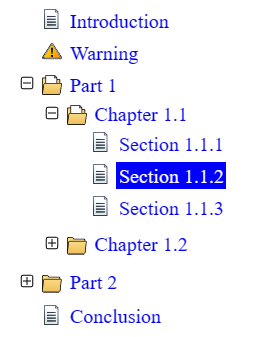
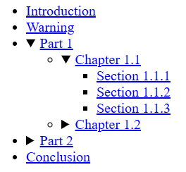

TreeView (HTML + CSS)
==================

What Is It?
-----------

Let’s imagine a large document consisting of many hierarchically organized parts: chapters, paragraphs, etc. We need to display the table of contents for it as a tree whose nodes can contain nested nodes and can collapse and expand when clicked. Note for desktop programmers: the closest analogue is the standard TreeView control found in any modern windowed operating system.

This is an example of creating such a tree, requiring no JavaScript programming (just pure HTML and CSS).



> [!IMPORTANT]
> The source code (HTML + CSS) is provided *as is,* since I mainly did this project for myself, but I will be glad if someone finds it useful. Also, I physically could not test  its appearance and behavior on a large number of browsers and especially mobile devices. Thus, I won’t mind if someone finds errors or wants to help the project in a different way.

This was originally just part of a project [Tree Of Contents](https://github.com/MichaelDemidov/JS-Tree-Of-Contents), but I thought it might be useful on its own.

Requirements
------------

HTML 5 and CSS 3.0.

I used new tags and CSS properties that appeared only in these versions, so this definitely won’t work on very old browsers. For those browsers you will have to use some JavaScript instead.

How It Works?
-------------

### HTML

First, let’s define the types of elements the tree can contain: a “leaf”, which is an element that does not contain children, and a “folder”, an element that has children. A “folder” node can have two states: open (its nested nodes are displayed on the screen) and closed.

The tree root is written using the good old bulleted list `<ul>`. Each node is a `<li>` list item that has a title and can contain a list of nested nodes. To provide interactive behavior, we’ll use a pair of `<details>` and `<summary>` tags, introduced in the HTML5 standard and specifically designed to create areas that collapse and expand on the mouse click.

So, the “leaf” of the tree looks like a plain list item `<li>`:

```html
<li><a href="link">Node Title</a></li>
```

And the “folder” item is something like this:

```html
<li>
  <details>
    <summary><a href="link">Node Title</a></summary>
    <ul>
      <!-- Nested Node List -->
    </ul>
  </details>
</li>
```

If the “folder” should initially appear in an open state, we need to add an `open` attribute to the `<details>` tag: `<details open>…</details>`.

That is all that concerns HTML. Now let’s look at the appearance of the tree.

### CSS

Without using CSS, the result is already usable, but it doesn’t look very pretty:



We would like to add different icons for “leaf”, opened and closed “folder”. We also need a plus or minus icon to be displayed to the left of the closed or opened folder respectively. And this is where the difficulties begin.

Both the `<li>` list item and the `<details>` element have a default marker — a circle and a triangle, respectively (see the picture above). They allow this marker to be replaced with an image, but neatly aligning those types of elements to the left seems to be quite difficult and it is not a fact that it will look the same in different browsers. After struggling for a while, I decided to get rid of all the markers and replace them with a `::before` pseudo-element, which at least can be made to look the same.

Thus, CSS selectors are needed for three situations:

1. A `<li>` item that does not contain `<details>` tag (“leaf”).
2. The `<details>` tag without the `open` attribute (closed “folder”).
3. The `<details>` tag with the `open` attribute (open “folder”).

There is a simple way: the plus and minus symbols could be made part of the icons. But I would like to be able to either replace these icons or add additional selectors (classes or identifiers) to assign a unique icon to a specific tree node, and then each such case would require drawing an icon with a plus or minus. Therefore, the `::before` pseudo-element must contain _two images at once._ To do this I used two its properties: `content` and `background-image`.

### Vector vs PNG Icons

There are two versions of the CSS: for the vector icons (`toc-svg-icons`) I used scalable SVG drawings that I drew myself for the nodes. SVG icons look better on large screens with high resolutions, while PNG icons are better suited to low resolutions.

> [!IMPORTANT]
> The raster format also has a disadvantage: when assigning an icon to a list item, if the image doesn’t fit the size of item marker, it is cropped, whereas a vector image is scaled.

> [!NOTE]
> I used the vector graphic editor Inkscape and saved the files in the “Optimized SVG” format so they take up less space, and then edited the XML manually to remove redundant comments, empty lines, etc.

I prepared five icon pictures: a “leaf”, a closed “folder”, an open “folder”, a plus icon for a closed “folder”, and a minus icon for an open “folder”.

    

For the second CSS (`toc-png-icons`) I used the same icons, but converted to PNG format (see the `images` subfolder). For small icons, this format looks better. Vector icons, on the other hand, look good on high screen resolutions. Additionally, I created a blank PNG icon for the “leaf” item to ensure the element is properly aligned on the same column as the plus and minus signs.

There are two HTML documents: `index-svg.html` and `index-png.html`. They have the same content but different CSS.

### Assigning Icons to Individual Nodes

Sometimes we need to change one or more of the tree node icons (opened / closed “folder” or “leaf”). To do this, simply append a class in the CSS file like this — a “leaf” icon:

```css
li.icon-warning::before {
  background-image: url("images/warning.png");
}
```

or this — opened and closed “folder” icons (note the “>” sign between the `li` and `details`, which ensures that higher-level folders don’t change their icons):

```css
li.icon-custom-folder > details[open] > summary::before {
  background-image: url("images/custom-folder-doc.png");
}
li.icon-custom-folder > details:not([open]) > summary::before {
  background-image: url("images/custom-folder.png");
}
```

And in the HTML assign the class to the `<li>` item:

```html
<li class="icon-warning">...</li>
```

### Final Remarks

First, I tried to create the HTML that relies minimally on CSS so that it works even if the CSS isn’t loaded (even if it looks ugly). Second, I tried to keep it as simple as possible.

Author
------
Copyright (c) 2024, Michael Demidov

Visit my GitHub page to check for updates, report issues, etc.: https://github.com/MichaelDemidov

Drop me an e-mail at: michael.v.demidov@gmail.com
